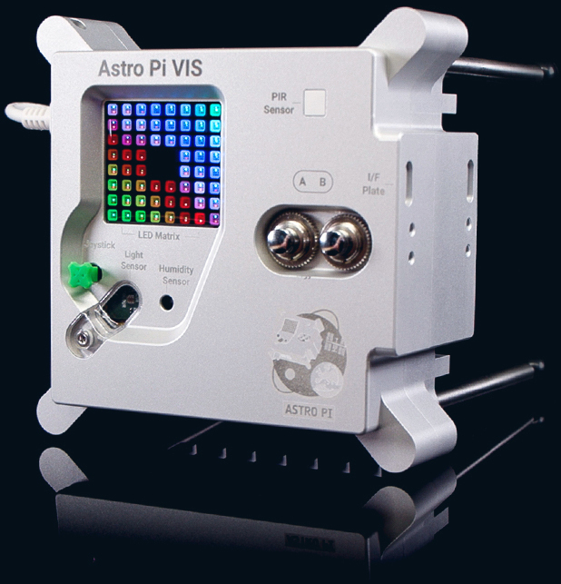
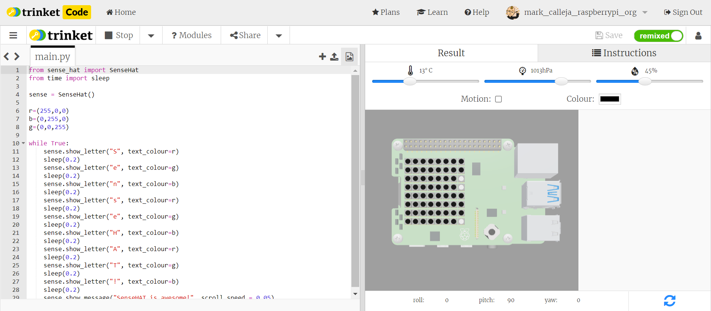

## Introduction

In this project, you will use the LED array on your SenseHAT to output text, using single characters and scrolling characters in different colours!

The SenseHAT is an add-on board designed by Raspberry Pi Limited as an environmental sensor and display. There are currently two Raspberry Pi SenseHATs, within the [Astro Pi](https://astro-pi.org) Flight Units, on the International Space Station. Young people all over the world can run their code in space as part of the AstroPi programme!

You will:
+ Display a single characters on the LED array 
+ Display scrolling text on the LED array 
+ Change how fast the text moves
+ Change the colour of the text and background

--- no-print ---
--- task ---
### Try it

  
This project shows both ways text can be displayed on the SenseHAT LED array - as single characters, or scrolling text. 

<iframe src="https://trinket.io/embed/python/342a5f7c2d?showInstructions=true" width="100%" height="356" frameborder="0" marginwidth="0" marginheight="0" allowfullscreen></iframe>

--- /task ---

--- /no-print ---

--- print-only ---

--- /print-only ---
