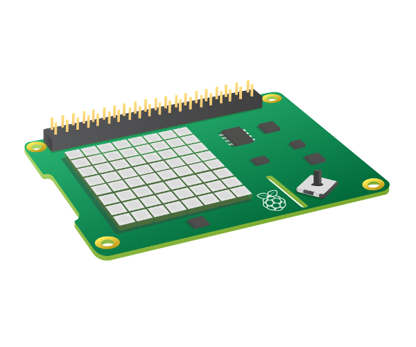

## Display single characters

In this step you will connect you SenseHAT to your Raspberry Pi, and show single characters on the SenseHAT LED array in different rotations. 

If you don't have access to a real Sense HAT, you can use the online Trinket emulator:

[[[rpi-sensehat-emulator]]]

<iframe src="https://trinket.io/embed/python/30c415346f" width="100%" height="600" frameborder="0" marginwidth="0" marginheight="0" allowfullscreen></iframe>

The Sense HAT is an add-on board for the Raspberry Pi, made especially for the [Astro Pi](http://astro-pi.org/){:target="_blank"} competition. The board allows you to make measurements of temperature, humidity, pressure, and orientation, and to output information using its built-in LED matrix.

[[[rpi-sensehat-attach]]]

The LED matrix on the SenseHAT is made of an 8 by 8 grid of RGB LEDs. Using python, you can control the LEDs to be any colour you like! 

Part of the `sense_hat` library allows you to show single characters on the LED array: `show_letter`. 

1. Display single characters
2. Change matrix rotation

--- task ---

Open the [Trinket SenseHAT starter project](https://trinket.io/python/9214a6136b?showInstructions=true){:target="_blank"}. Trinket will open in another browser tab.

--- /task ---

With any python program, we start by `importing` the libraries we need to make our code run. These are bits of code that allow the computer to understand what commands you are giving it. If we don't import the necessary libraries first, any commands we give the computer in our program won't be understood and we will see an error.

--- task ---
**Add:** At the top of your new code window add the following lines to `import` both the `sense_hat` library which we need to control the SenseHAT, and the `time` library which allows us to keep track of when parts of our program will run or stop: Both of these libraries are vital in using your SenseHAT. The final line of code sets up our program to call upon our imported SenseHat library whenever we type `sense`.

--- code ---
---
language: python
filename: main.py
line_numbers: true
line_number_start: 1
line_highlights: 1-4
---
from sense_hat import SenseHat
from time import sleep

sense = SenseHat()
--- /code ---

--- /task ---

Now, we need to add some code that will show a single character on your SenseHAT's LED array. 

--- task ---

**Add:** Leave a blank line under your current code, and add the final line shown here. I have used the character 'S', but you can use any letter you like:

--- code ---
---
language: python
filename: main.py
line_numbers: true
line_number_start: 1 
line_highlights: 6
---
from sense_hat import SenseHat
from time import sleep

sense = SenseHat()

sense.show_letter("S")
--- /code ---

--- /task ---

--- save ---